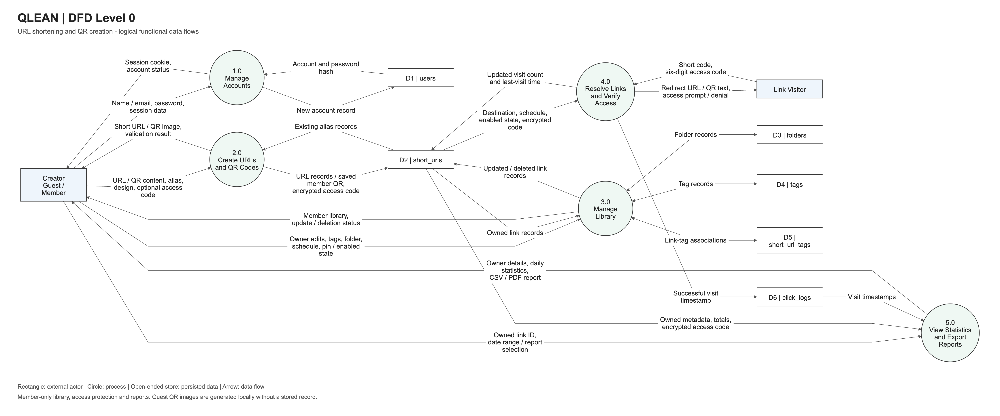
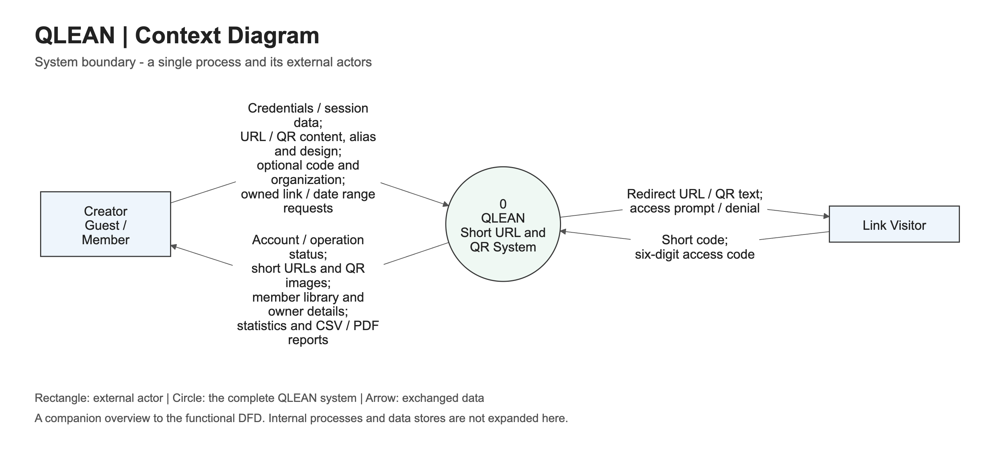

# DFD Level 0

[Back to README](../README.md)

Files: [PNG](diagrams/dfd-level-0.png), [SVG](diagrams/dfd-level-0.svg),
[editable Mermaid source](diagrams/dfd-level-0.mmd).

This is a logical DFD of the implemented functions, not a frontend/backend
architecture diagram. Processes include both browser and API work.

| Process | Scope |
| --- | --- |
| 1.0 Manage Accounts | Registration, username/email login, logout and session validation |
| 2.0 Create URLs and QR Codes | Content validation, aliases, QR design and optional access-code encryption |
| 3.0 Manage Library | Owner-only listing, edits/deletion, tags, folders, schedules, pins and enabled state |
| 4.0 Resolve Links and Verify Access | Availability checks, code verification, redirects/text delivery and successful-visit logging |
| 5.0 View Statistics and Export Reports | Owner details, decrypted owner access code, date ranges, daily totals and browser CSV/PDF exports |

Data stores D1-D6 correspond to the six PostgreSQL tables. Redis is a derived
statistics cache rather than a separate source of business data.
Guest URLs are stored without an owner; guest QR images are generated in the
browser without a database record. Failed/blocked access does not log a visit.

## Context Diagram

Files: [PNG](diagrams/dfd-context.png), [SVG](diagrams/dfd-context.svg),
[editable source](diagrams/dfd-context.mmd).

The context view treats QLEAN as process 0; the main diagram decomposes it into
processes 1.0-5.0. Both views are provided because level naming varies between
courses. Match the required terminology with your assignment's examples.

Mermaid sources can be edited in the [Mermaid Live Editor](https://mermaid.live).
Notation reference: [DFD teaching examples, RMUTI](https://www.rmuti.ac.th/user/kedkarn/2012/software_en/ex_dfd_lec6.pdf).
