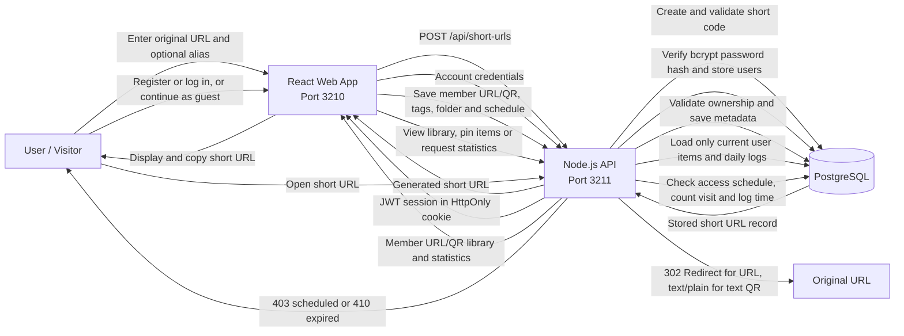

# DFD Level 0

```mermaid
flowchart LR
  User[User / Visitor]
  Web[React Web App<br/>Port 3210]
  API[Node.js API<br/>Port 3211]
  DB[(PostgreSQL)]
  Target[Original URL]

  User -->|Enter original URL and optional alias| Web
  Web -->|POST /api/short-urls| API
  API -->|Create and validate short code| DB
  DB -->|Stored short URL record| API
  API -->|Generated short URL| Web
  Web -->|Display and copy short URL| User

  User -->|Register or log in, or continue as guest| Web
  Web -->|Account credentials| API
  API -->|Verify bcrypt password hash and store users| DB
  API -->|JWT session in HttpOnly cookie| Web
  Web -->|Save member URL/QR, tags, folder and schedule| API
  API -->|Validate ownership and save metadata| DB
  Web -->|View library, pin items or request statistics| API
  API -->|Load only current user items and daily logs| DB
  API -->|Member URL/QR library and statistics| Web

  User -->|Open short URL| API
  API -->|Check access schedule, count visit and log time| DB
  API -->|302 Redirect for URL, text/plain for text QR| Target
  API -->|403 scheduled or 410 expired| User
```
