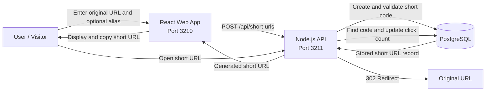

# DFD Level 0

```mermaid
flowchart LR
  User[User / Visitor]
  Web[React Web App<br/>Port 3210]
  API[Node.js API<br/>Port 3211]
  DB[(PostgreSQL)]
  Target[Original URL]

  User -->|Enter original URL and optional alias| Web
  Web -->|POST /api/short-urls| API
  API -->|Create and validate short code| DB
  DB -->|Stored short URL record| API
  API -->|Generated short URL| Web
  Web -->|Display and copy short URL| User

  User -->|Open short URL| API
  API -->|Find code and update click count| DB
  API -->|302 Redirect| Target
```
