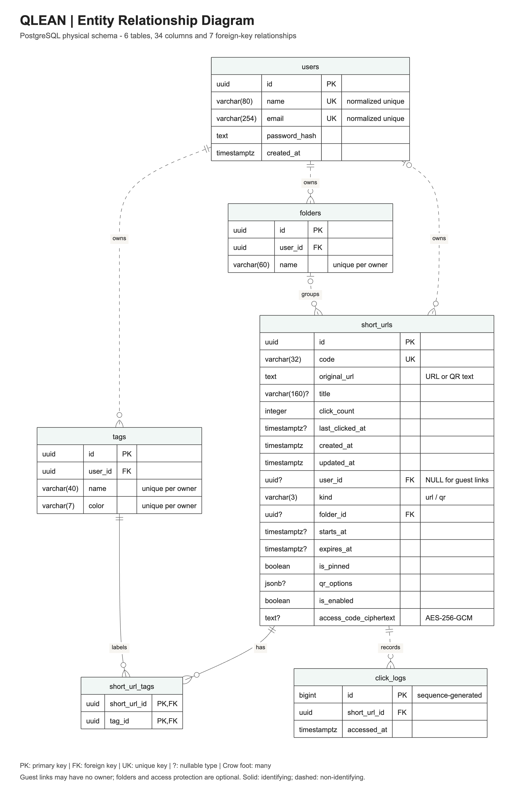

# ER Diagram

[Back to README](../README.md)

Files: [PNG](diagrams/er-diagram.png), [SVG](diagrams/er-diagram.svg),
[editable Mermaid source](diagrams/er-diagram.mmd).

The physical model includes all **6 tables and 34 columns**, checked against
the local PostgreSQL schema and [SQL migrations](../Backend/db/migrations).

## Keys and Relationships

- PK: primary key; FK: foreign key; UK: unique key; a type ending in `?` is nullable.
- A guest short URL has no owner, so its user relationship is optional (0..1).
- Folder assignment is optional; each tag/folder belongs to exactly one user.
- Links and tags have a many-to-many relationship through `short_url_tags`.
  Its two foreign keys form the composite primary key.
- A link has zero or more click logs; each log belongs to exactly one link.
- Solid lines identify a child through its parent's key; dashed lines are
  non-identifying relationships. Crow's-foot endpoints show cardinality.

## Constraints

- Usernames/emails are unique after `lower(btrim(...))` normalization.
- Tag/folder names are unique per owner, case-insensitively. Tag colors are
  also unique per owner; they are not globally unique fields.
- `kind` is `url` or `qr`. `original_url` can store plain text for QR content.
- Access codes are stored as encrypted ciphertext, not plaintext; the key is
  stored separately and is not a database entity. Account passwords are hashed.
- Removing a user/folder sets matching link references to NULL. Removing a link
  or tag cascades to its join records; deleting a link also removes click logs.

Sources can be edited in the [Mermaid Live Editor](https://mermaid.live).
Notation: [Mermaid ER syntax and cardinality](https://mermaid.js.org/syntax/entityRelationshipDiagram.html).
