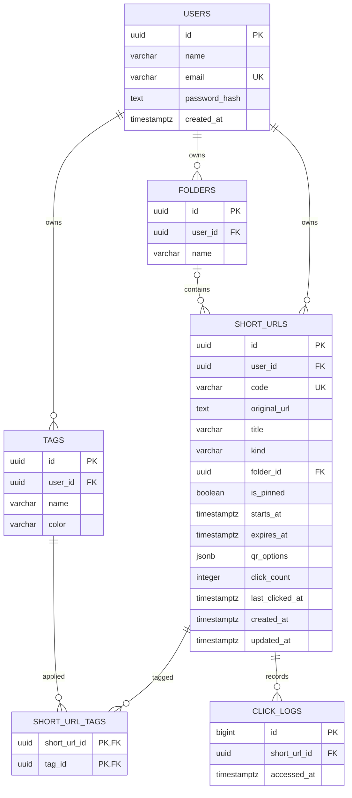

# ER Diagram

```mermaid
erDiagram
  USERS ||--o{ SHORT_URLS : owns
  USERS ||--o{ TAGS : owns
  USERS ||--o{ FOLDERS : owns
  FOLDERS o|--o{ SHORT_URLS : contains
  SHORT_URLS ||--o{ SHORT_URL_TAGS : tagged
  TAGS ||--o{ SHORT_URL_TAGS : applied
  SHORT_URLS ||--o{ CLICK_LOGS : records
  USERS {
    uuid id PK
    varchar name
    varchar email UK
    text password_hash
    timestamptz created_at
  }
  SHORT_URLS {
    uuid id PK
    uuid user_id FK
    varchar code UK
    text original_url
    varchar title
    varchar kind
    uuid folder_id FK
    boolean is_pinned
    timestamptz starts_at
    timestamptz expires_at
    jsonb qr_options
    integer click_count
    timestamptz last_clicked_at
    timestamptz created_at
    timestamptz updated_at
  }
  TAGS {
    uuid id PK
    uuid user_id FK
    varchar name
    varchar color
  }
  FOLDERS {
    uuid id PK
    uuid user_id FK
    varchar name
  }
  SHORT_URL_TAGS {
    uuid short_url_id PK,FK
    uuid tag_id PK,FK
  }
  CLICK_LOGS {
    bigint id PK
    uuid short_url_id FK
    timestamptz accessed_at
  }
```
